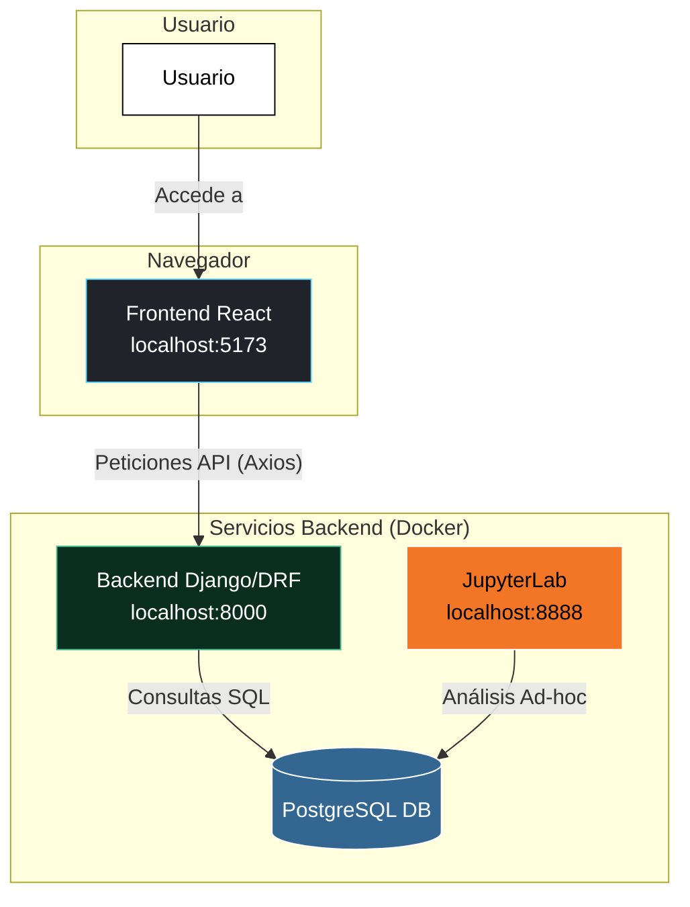

# Sales Analysis System

[](https://www.python.org/downloads/release/python-311/)
[](https://www.djangoproject.com/)
[](https://reactjs.org/)
[](https://opensource.org/licenses/MIT)

Este proyecto es una aplicación web full-stack diseñada para analizar y visualizar datos de ventas. Cuenta con un backend de Django que expone una API REST, una base de datos PostgreSQL, un entorno de análisis de datos con JupyterLab y un dashboard dinámico en React. Toda la aplicación está contenedorizada con Docker para facilitar su configuración y despliegue.

---

## 🏛️ Arquitectura del Sistema

El sistema está diseñado con una arquitectura de microservicios desacoplada, orquestada por Docker Compose. Esto permite que cada componente funcione de manera independiente, facilitando el desarrollo, la escalabilidad y el mantenimiento.



*   **Frontend:** Una Single-Page Application (SPA) construida con React que consume los datos de la API y los presenta en un dashboard interactivo.
*   **Backend:** Una API REST construida con Django y Django REST Framework que gestiona la lógica de negocio y las interacciones con la base de datos.
*   **Base de Datos:** Una instancia de PostgreSQL que sirve como el almacén de datos persistente para la aplicación.
*   **Análisis de Datos:** Un entorno de JupyterLab para la exploración y análisis de datos ad-hoc directamente contra la base de datos.

---

## 🛠️ Stack Tecnológico

*   **Backend:** Django, Django REST Framework
*   **Frontend:** React, Vite, Chart.js, Axios
*   **Base de Datos:** PostgreSQL
*   **Contenerización:** Docker, Docker Compose
*   **Análisis de Datos:** JupyterLab, Pandas
*   **Calidad de Código:** `pre-commit`, Black, Ruff

---

## 🚀 Guía de Inicio Rápido (Local)

Sigue estos pasos para levantar el entorno de desarrollo completo en tu máquina local.

### Prerrequisitos

*   [Docker](https://www.docker.com/products/docker-desktop/)
*   [Docker Compose](https://docs.docker.com/compose/install/) (generalmente incluido con Docker Desktop)

### Pasos de Instalación

1.  **Clonar el Repositorio**
    ```bash
    git clone https://github.com/tu-usuario/sales-analytics-system.git
    cd sales-analytics-system
    ```

2.  **Configurar el Entorno**
    Copia el archivo de ejemplo `.env.example` a un nuevo archivo `.env`. Este archivo es ignorado por Git para proteger tus secretos.
    ```bash
    cp env.example .env
    ```
    Abre el archivo `.env` y asegúrate de que todas las variables estén configuradas, especialmente `SECRET_KEY`. Puedes generar una clave secreta fuerte [aquí](https://djecrety.ir/).

3.  **Levantar los Servicios**
    Este comando construirá las imágenes de Docker (si no existen) y iniciará todos los contenedores en segundo plano (`-d`).
    ```bash
    docker-compose up -d --build
    ```

4.  **Preparar la Base de Datos**
    Ejecuta las migraciones de Django para crear las tablas en la base de datos PostgreSQL.
    ```bash
    docker-compose exec web python manage.py migrate
    ```

5.  **Cargar Datos de Prueba (Opcional pero Recomendado)**
    a. Genera un archivo CSV con 300,000 registros de ventas de prueba:
    ```bash
    docker-compose exec web python generate_sales_data.py
    ```
    b. Carga los datos del CSV a la base de datos usando el comando personalizado de Django:
    ```bash
    docker-compose exec web python manage.py load_sales_data
    ```

### Acceso a los Servicios

Una vez que todos los contenedores estén en funcionamiento, puedes acceder a los servicios en las siguientes URLs:

*   🌐 **Dashboard Web (React):** [http://localhost:5173](http://localhost:5173)
*   ⚙️ **API Backend (Django):** [http://localhost:8000/api/](http://localhost:8000/api/)
*   🔬 **Análisis de Datos (JupyterLab):** [http://localhost:8888](http://localhost:8888)
    *   **Nota:** Para acceder a JupyterLab por primera vez, necesitarás un token. Obtenlo ejecutando: `docker-compose logs notebook` y busca una URL que contenga `?token=...`.

---

## ☁️ Guía de Despliegue a Producción

Desplegar esta aplicación en un entorno de producción requiere consideraciones adicionales de seguridad, rendimiento y escalabilidad.

### Estrategia General

1.  **Imágenes Optimizadas:** Utilizar `Dockerfile` multi-etapa para crear imágenes ligeras y seguras, sin herramientas de desarrollo.
2.  **Servidor WSGI:** Usar un servidor WSGI de producción como Gunicorn o uWSGI en lugar del servidor de desarrollo de Django.
3.  **Variables de Entorno Seguras:** Gestionar los secretos (como `SECRET_KEY` y credenciales de la base de datos) a través del sistema de gestión de secretos del proveedor de la nube (ej. AWS Secrets Manager, Heroku Config Vars).
4.  **Base de Datos Gestionada:** Utilizar un servicio de base de datos gestionado (como Amazon RDS, Google Cloud SQL o Heroku Postgres) en lugar de un contenedor de Docker para la base de datos.
5.  **Servir Archivos Estáticos:** Configurar un servicio de almacenamiento de objetos como AWS S3 para servir los archivos estáticos del backend de Django.
6.  **CORS Restringido:** Configurar `django-cors-headers` para permitir peticiones únicamente desde el dominio del frontend de producción.

### Ejemplo de Plataformas de Despliegue

*   **IaaS (Infrastructure as a Service):** Desplegar los contenedores en una máquina virtual en proveedores como **DigitalOcean**, **AWS EC2** o **Vultr**, gestionando la red y la seguridad manualmente.
*   **PaaS (Platform as a Service):** Utilizar plataformas como **Heroku**, **Render** o **AWS Elastic Beanstalk** que abstraen gran parte de la infraestructura, permitiendo un despliegue más rápido gestionado a través de `git push` o conectando el repositorio.

---

## ✨ Futuras Mejoras

*   **Autenticación de Usuarios:** Implementar un sistema de autenticación basado en tokens (JWT) para proteger la API y el dashboard.
*   **Actualizaciones en Tiempo Real:** Integrar WebSockets (usando Django Channels) para que los gráficos del dashboard se actualicen en tiempo real a medida que llegan nuevos datos.
*   **Sistema de Caching:** Implementar un sistema de caché con Redis para los endpoints de la API que son computacionalmente costosos, reduciendo la carga en la base de datos.
*   **Cobertura de Pruebas:** Ampliar el conjunto de pruebas unitarias y de integración para asegurar la fiabilidad del código.
*   **Exportación de Datos:** Añadir funcionalidades al frontend para permitir a los usuarios exportar los datos de los gráficos a formatos como CSV o PNG.
